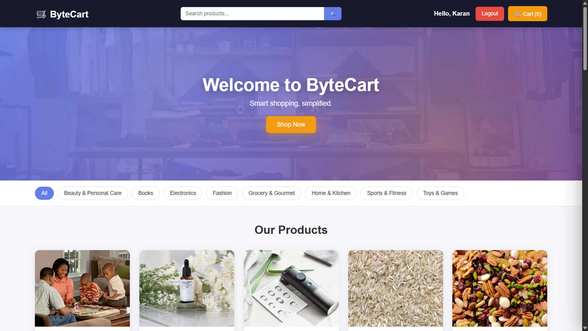
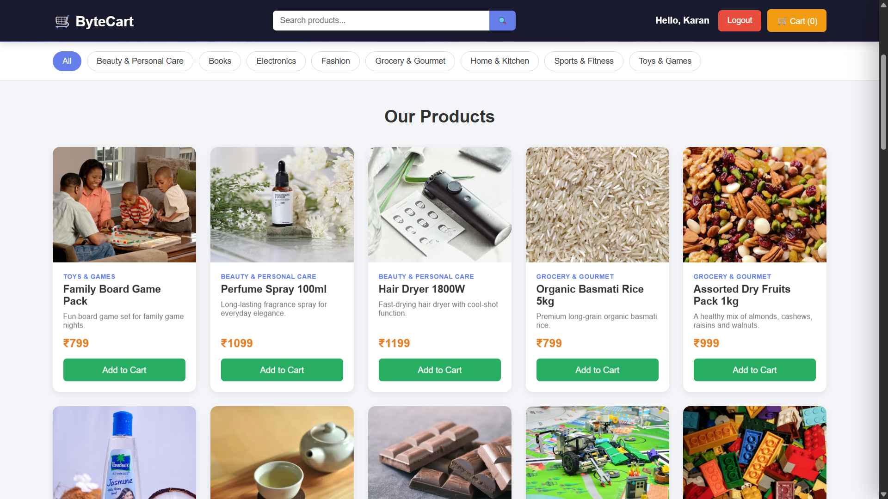
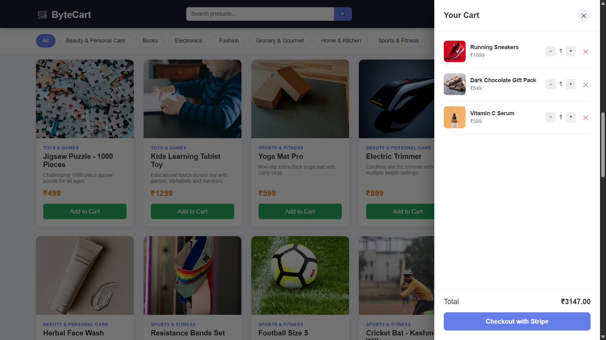
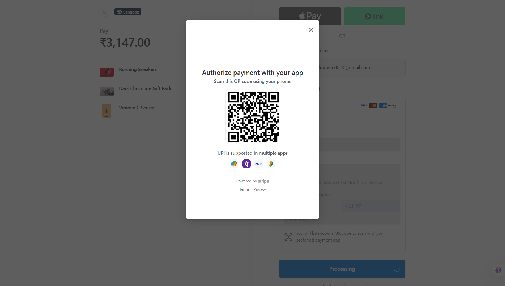
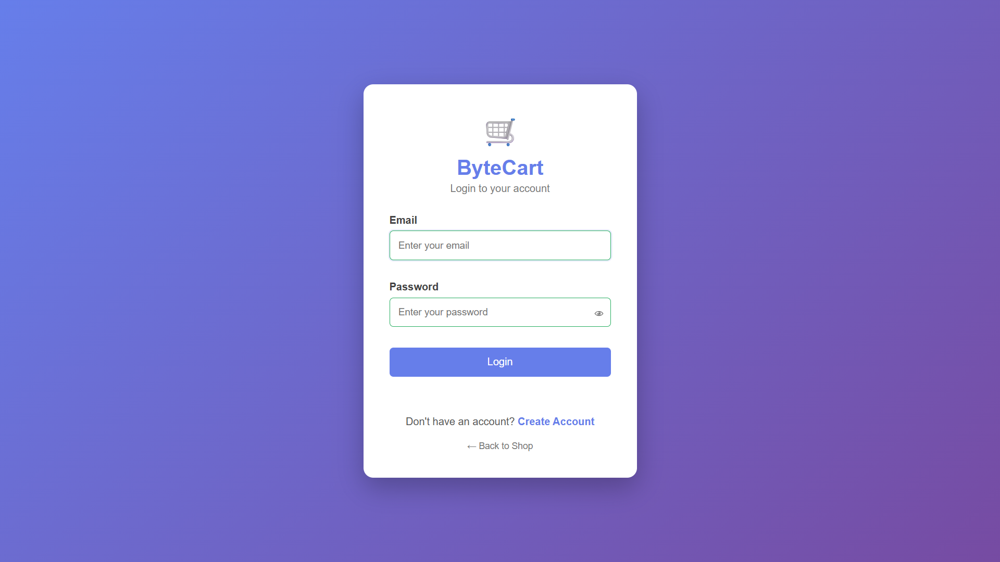
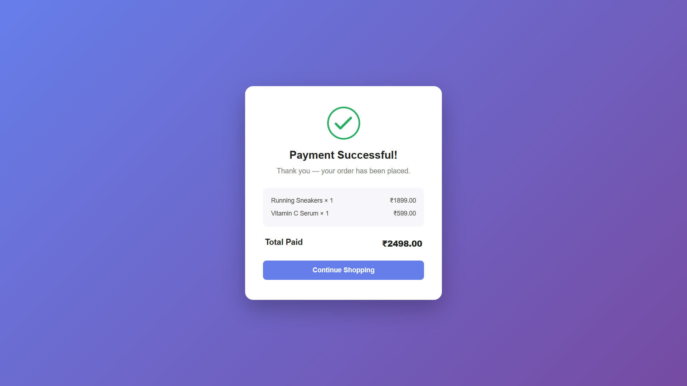

<div align="center">

<!--
  Add your logo here. Easiest options:
  1. Create a simple logo (Canva, Figma, or even just styled text) and save it as
     public/logo.png or docs/logo.png in your repo, then point the src below at it.
  2. Or use a quick placeholder shield-style badge instead — already added below.
-->


# 🛒 ByteCart

### A Full-Stack E-Commerce Website — Node.js · Express · MongoDB · Stripe/UPI

Real signup/login, 40 products across 8 categories, an animated cart, and a working Stripe checkout with UPI + card support.

<p>
  
  
  
  
  
  
</p>

<p>
  <a href="https://bytecart-n983.onrender.com"><strong>🔗 Live Demo</strong></a>
  ·
  <a href="#-screenshots">Screenshots</a>
  ·
  <a href="#-features">Features</a>
  ·
  <a href="#-running-on-localhost">Setup</a>
</p>

</div>

---

## 📖 About

ByteCart is a complete e-commerce storefront built from scratch — no boilerplate, no templates. It handles real user accounts (hashed passwords, JWT sessions), a real product catalog backed by MongoDB, and real payment processing through Stripe, including UPI/QR-code checkout for Indian customers. Built as a portfolio project to demonstrate full-stack fundamentals: authentication, database design, secure payment handling, and a polished, animated frontend — all without a frontend framework.

## 🖼️ Screenshots

<!--
  Add your own screenshots below, one at a time. For each one:
  1. Take the screenshot
  2. Save it into a folder like docs/screenshots/ in your repo (create the folder if it doesn't exist)
     e.g. docs/screenshots/homepage.png
  3. Replace the src path below to match your filename
  Keep them in this same "row" format so they display neatly side by side on GitHub.
-->

<div align="center">

| Homepage | Product Browsing |
|---|---|
|  |  |

| Cart Drawer | Stripe Checkout (UPI) |
|---|---|
|  |  |

| Login / Signup | Order Confirmation |
|---|---|
|  |  |

</div>

> 💡 Don't have screenshots yet? See [Adding Your Screenshots](#-adding-your-screenshots) below for the fastest way to capture and add them.

## ✨ Features

- 🔐 **Authentication** — Sign up and login with live field validation, a password strength meter, and a show/hide password toggle. Passwords hashed with bcrypt; sessions handled via JWT in an httpOnly cookie.
- 🛍️ **40 real products** across 8 categories, each with a genuine, individually verified product photo
- 🔎 **Category filtering + live search**
- 🎨 **Interactive UI**
  - 3D tilt effect on product cards that follows your cursor
  - Parallax hero banner
  - Scroll-reveal animations as products enter the viewport
  - "Fly to cart" animation when adding an item
- 🛒 **Slide-out cart drawer** with animated quantity controls; cart persists across page refreshes
- 🔔 **Toast notifications** instead of browser `alert()` popups
- 💳 **Real Stripe checkout** (test mode) — supports both **card payments** and **UPI** (QR code / scan-to-pay for Indian customers)
- 📦 **Order tracking** — orders saved in MongoDB against the logged-in user, with live payment status
- 📱 **Fully responsive** — plain HTML/CSS/JS, no framework or build step required

## 🧰 Tech Stack

| Layer | Technology |
|---|---|
| Frontend | HTML5, CSS3, Vanilla JavaScript |
| Backend | Node.js, Express |
| Database | MongoDB Atlas (Mongoose) |
| Auth | JWT (httpOnly cookie) + bcryptjs |
| Payments | Stripe Checkout — Card + UPI |
| Hosting | Render (backend) + MongoDB Atlas (database) |

## 📁 Project Structure

```
ByteCart/
├── database/
│   └── db.js                # MongoDB connection (Mongoose)
├── middleware/
│   └── auth.js              # JWT auth middleware
├── models/
│   ├── User.js
│   ├── Product.js
│   └── Order.js             # includes Stripe payment status
├── seed/
│   ├── products.js          # 40 sample products data
│   └── seed.js              # Script to insert products into MongoDB
├── public/                  # Frontend (served as static files)
│   ├── index.html           # Home page (hero, products, cart drawer)
│   ├── login.html
│   ├── register.html
│   ├── success.html         # Stripe payment success page
│   ├── cancel.html          # Stripe payment cancelled page
│   ├── style.css
│   ├── login.css
│   ├── result-page.css
│   ├── script.js
│   └── auth.js
├── docs/
│   └── screenshots/         # README screenshots live here
├── server.js                # Express app + all API routes + Stripe
├── package.json
├── .env.example
└── .gitignore
```

## 🚀 Running on localhost

### 1. Prerequisites

- [Node.js](https://nodejs.org) v18+
- A [MongoDB Atlas](https://www.mongodb.com/atlas) account (free tier) — or a local MongoDB install
- A free [Stripe account](https://dashboard.stripe.com/register) (test mode — no real card ever gets charged)

### 2. Install dependencies

```bash
git clone https://github.com/codewithkaran-64/ByteCart.git
cd ByteCart
npm install
```

### 3. Configure environment variables

Copy `.env.example` to `.env` and fill in your own values:

```env
MONGODB_URI=your_mongodb_connection_string
JWT_SECRET=any-long-random-string
PORT=3000
STRIPE_PUBLISHABLE_KEY=pk_test_your_key_here
STRIPE_SECRET_KEY=sk_test_your_key_here
CLIENT_URL=http://localhost:3000
```

### 4. Seed the database

```bash
npm run seed
```

### 5. Start the server

```bash
npm start
# or, for auto-restart during development:
npm run dev
```

Visit **http://localhost:3000** 🎉

## 💳 Testing the Payment Flow

Add items to your cart → **Checkout** → on Stripe's hosted page, use any official Stripe test card:

| Card number | Result |
|---|---|
| `4242 4242 4242 4242` | Payment succeeds |
| `4000 0000 0000 9995` | Payment is declined |

Any future expiry date, any 3-digit CVC, any postal code. For **UPI**, click "Simulate scan" on the QR modal — Stripe's built-in test-mode substitute for a real phone scan.

## 🔑 API Overview

| Method | Route | Description | Auth |
|---|---|---|---|
| POST | `/api/register` | Create a new account | No |
| POST | `/api/login` | Login, sets JWT cookie | No |
| POST | `/api/logout` | Logout, clears cookie | No |
| GET | `/api/user` | Get currently logged-in user | No |
| GET | `/api/products` | List products (`?category=`, `?search=`) | No |
| GET | `/api/categories` | List all categories | No |
| POST | `/api/create-checkout-session` | Create a Stripe Checkout session | Yes |
| GET | `/api/checkout-session/:id` | Verify a completed session, save order | Yes |
| GET | `/api/orders` | Get the logged-in user's orders | Yes |

## 🌐 Live Deployment

- **Live site:** [bytecart-n983.onrender.com](https://bytecart-n983.onrender.com)
- **Hosting:** Render (free tier — the app may take ~30–60s to wake up if it's been idle)
- **Database:** MongoDB Atlas

## 📸 Adding Your Screenshots

The fastest way to fill in the screenshots above:

1. Run the app locally (`npm run dev`) or open your live Render URL
2. Take a screenshot of each page (homepage, products, cart open, checkout, login, success page)
3. Create a folder in your repo: `docs/screenshots/`
4. Save each image there with a matching filename (e.g. `homepage.png`, `products.png`, `cart.png`, `checkout-upi.png`, `login.png`, `success.png`)
5. Commit and push:
   ```bash
   git add docs/screenshots
   git commit -m "Add project screenshots"
   git push
   ```
6. Refresh the repo page on GitHub — the images in this README will render automatically since the paths already point to those files.

## 🔒 Security Notes

- Passwords are hashed with bcrypt — never stored in plain text
- Sessions use a JWT in an **httpOnly** cookie, inaccessible to client-side JS
- Product prices are always re-fetched from MongoDB when creating a Stripe session — cart data from the browser is never trusted for pricing
- Before going live with real payments: rotate `JWT_SECRET`, set `cookie.secure: true` once served over HTTPS, and switch Stripe keys from test to live mode

## 📌 Possible Next Steps

- [ ] Admin dashboard to manage products from the UI
- [ ] Order-history page on the frontend
- [ ] Stripe webhook handler for production-grade payment confirmation
- [ ] Product detail pages
- [ ] Wishlist / saved items

## 📄 License

This project is licensed under the ISC License.

---

<div align="center">

Built by **Karan Choudhary**

</div>
